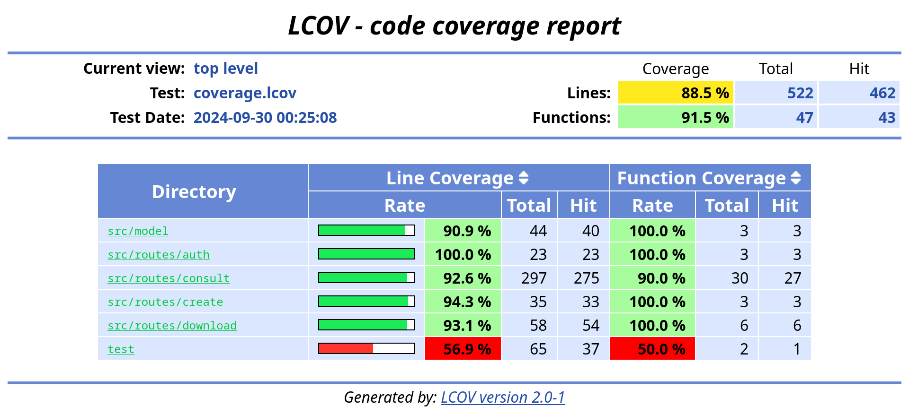

# MTR SINIR/SIGOR WebService routes

[](https://jsr.io/@stallone-dev/mtr-web-service-internals)
[](https://jsr.io/@stallone-dev/mtr-web-service-internals)

Conjunto de ferramentas `TypeScript` para consumo das APIs do [MTR WebService - SINIR/SIGOR](https://cetesb.sp.gov.br/sigor-mtr/web-service/) para MTRs.

Baseado na versão: `SIGOR - 1.15.0 - 21/08/24`

Neste projeto está implementado cada rota atualmente ativa da API WebService:

|        Grupo de rotas         | Namespace                 |
| :----------------------: | :------------------------ |
|       Autenticação       | `MtrWSInternals.auth`          |
|     Consulta de dados      | `MtrWSInternals.consult`     |
| Geração de MTRs/CDFs/Alterações | `MtrWSInternals.create`  |
|Recebimento de MTRs/CDFs/Alterações|`MtrWSInternals.receive`|
|  Exclusão de MTRs  | `MtrWSInternals.remove` |
|Download de MTRs/CDFs|`MtrWSInternals.download`|

Também re-exporta a tipagem do projeto [MTR WebService Types](https://jsr.io/@stallone-dev/types-mtr-web-service) para simplificar a implementação.

## Instalação

Este pacote está distribuído exclusivamente através do [JavaScript Registry (JSR)](https://jsr.io/@stallone-dev/mtr-web-service-internals/).

#### DenoJS

```bash
deno add @stallone-dev/mtr-web-service-internals
```

#### Bun

```bash
bunx jsr add @stallone-dev/mtr-web-service-internals
```

#### NodeJS (npm)

```bash
npx jsr add @stallone-dev/mtr-web-service-internals
```

#### NodeJS (yarn)

```bash
yarn dlx jsr add @stallone-dev/mtr-web-service-internals
```

## Aplicação

Para todos os meios, é importante referenciar dentro do projeto `.ts` como um `import`:

```ts
// Importando somente as funções
import { MtrWSInternals } from "@stallone-dev/mtr-web-service-internals/";

// Importando somente a tipagem dos módulos da API
import type { MtrWSType } from "@stallone-dev/mtr-web-service-internals/";

// Importando somente as URLs-base da API
import { MtrWSBaseURL } from "@stallone-dev/mtr-web-service-internals/";

// Importando todos ao mesmo tempo
import {
    MtrWSBaseURL,
    MtrWSInternals,
    type MtrWSType,
} from "@stallone-dev/mtr-web-service-internals/";
```

## Testes / Cobertura


## Exemplos de uso

#### Gerando um token de acesso

```ts
import { MtrWSBaseURL, MtrWSInternals, type MtrWSType } from "@stallone-dev/mtr-web-service-internals/";

// Definindo a base URL da API
const base_url = MtrWSBaseURL.SINIR;

// Preparando credenciais
const credentials: MtrWSType.auth.credentials = {
    cpfCnpj: "1234567890",
    senha: "MY_PASS_123",
    unidade: "010101",
};

// Acionando requisição de token
const request = new MtrWSInternals.auth.gerarAuthToken({
    API_BASE_URL: base_url,
    credentials: credentials,
});

// Capturando token
const token = await request.getResult();
// ==> "Bearer ..."
```

#### Consultando dados de um MTR

```ts
import { MtrWSBaseURL, MtrWSInternals } from "@stallone-dev/mtr-web-service-internals/";

// Definindo a base URL da API
const base_url = MtrWSBaseURL.SINIR;

// Definindo configurações
const token = "Bearer ...";
const mtr = "1234567890";

// Acionando requisição de dados do MTR
const request = new MtrWSInternals.consult.consultarDadosDoMTR({
    API_BASE_URL: base_url,
    authToken: token,
    mtrID: mtr,
});

// Capturando dados do MTR
const result = await request.getResult();
// ==> { * objeto-mtr * }
```

#### Consultando a lista de resíduos

```ts
import { MtrWSBaseURL, MtrWSInternals } from "@stallone-dev/mtr-web-service-internals/";

// Definindo a base URL da API
const base_url = MtrWSBaseURL.SINIR;

// Definindo configurações
const token = "Bearer ...";

// Acionando requisição de dados do MTR
const request = new MtrWSInternals.consult.listarResiduos({
    API_BASE_URL: base_url,
    authToken: token,
});

// Capturando lista de resíduos
const result = await request.getResult();
// ==> { * [ lista-re-residuos ] * }
```

### Gerando um MTR

```ts
import { MtrWSBaseURL, MtrWSInternals, type MtrWSType } from "@stallone-dev/mtr-web-service-internals/";

// Definindo a base URL da API
const base_url = MtrWSBaseURL.SINIR;

// Definindo configurações
const token = "Bearer ...";

const data_mtr: MtrWSType.requestModel.gerarLoteMTR = {
    armazenadorTemporario: {
        cpfCnpj: "99999999999999", unidade: 99999
    },
    transportador: {
        cpfCnpj: "99999999999999", unidade: 99999
    },
    destinador: {
        cpfCnpj: "99999999999999", unidade: 99999
    },
    nomeResponsavel: "Test owner",
    observacoes: "Test",

    listaManifestoResiduos: [{
        claCodigo: 1,
        marQuantidade: 1.0,
        resCodigoIbama: "170107",
        tiaCodigo: 3,
        tieCodigo: 2,
        traCodigo: 12,
        uniCodigo: 3,
    }],
};

// Acionando requisição de dados do MTR
const request = new MtrWSInternals.create.gerarLoteMTR({
    API_BASE_URL: base_url,
    authToken: token,
    dadosParaEmissaoLoteMTR: [data_mtr],
});

// Capturando lista de resíduos
const result = await request.getResult();
// ==> { * [ retorno-de-cada-mtr ] * }
```
